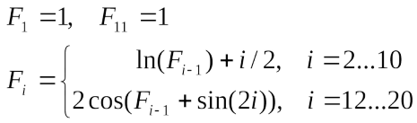

<p align="center"><b>МОНУ НТУУ КПІ ім. Ігоря Сікорського ФПМ СПіСКС</b></p>
<p align="center">
<b>Звіт з Розрахунково Графічної Роботи</b><br/>
дисципліни "Вступ до функціонального програмування"
</p>
<p align="right"><b>Студент</b>: Мануйлов Денис Денисович КВ-21</p>
<p align="right"><b>Рік</b>: 2025</p>  

## Завдання на розрахунково-графічну роботу
1. Реалізувати програму для обчислення функції згідно варіанту мовою Common Lisp.  
2. Виконати тестування реалізованої програми.  
3. Порівняти результати роботи програми мовою Common Lisp с розрахунками іншими засобами.  

## Варіант 11
<p align="center">

</p>

## Реалізація програми мовою Common Lisp
```Lisp
(defun F1-F20 ()
  (let ((res-list '(1.0))
        (f-prev 1))
    (do ((i 2 (incf i)))
        ((> i 20) (nreverse res-list))
      (cond
        ((< i 11) (setf f-prev (+ (log f-prev) (/ i 2.0))))
        ((= i 11) (setf f-prev 1))
        (t (setf f-prev (* 2 (cos (+ f-prev (sin (* 2 i))))))))
        (push f-prev res-list))))

(defun my-print (inp-list)
  (format t "   F(i)       Result~%")
  (format t "-------------------------~%")
  (loop for val in inp-list
        for i from 1
        do (format t "   F(~2d)  ~15,5f~%" i val)))

(defun RGR ()
  (let ((result-list (F1-F20)))
    (my-print result-list)))
```
## Реалізація програми мовою C++
*Генерує еталонні дані та зберігає результати у `cpp_results.txt` для подальшого порівняння.*
```cpp
#include <iostream>
#include <fstream>
#include <vector>
#include <cmath>
#include <iomanip> 

using namespace std;

int main() 
{
    vector<double> F(21);
    F[1] = 1.0;
    F[11] = 1.0;

    for (int i = 2; i <= 10; i++) 
        F[i] = log(F[i - 1]) + i / 2.0;  

    for (int i = 12; i <= 20; i++) 
        F[i] = 2 * cos(F[i - 1] + sin(2 * i));

    ofstream outfile("cpp_results.txt");
    if (outfile.is_open()) 
    {
        outfile << fixed << setprecision(10);
        for (int i = 1; i <= 20; i++) 
            outfile << F[i] << endl;
        outfile.close();
        cout << "File 'cpp_results.txt' created." << endl;
    }
    else 
        cout << "Error opening file!" << endl;

    return 0;
}
```

## Реалізація тестових утиліт і тестових наборів
```lisp
(defun read-cpp-file (filename)
  (let ((result nil))
    (with-open-file (stream filename :if-does-not-exist nil)
      (if stream
          (loop for num = (read stream nil 'eof)
                until (eq num 'eof)
                do (push num result))
          (format t "ERROR: File ~s not found!~%" filename)))
    (nreverse result)))

(defun check-equals (val1 val2)
  (let ((epsilon 0.0001))
    (< (abs (- val1 val2)) epsilon)))

(defun test-case (index lisp-val cpp-val)
  (if (check-equals lisp-val cpp-val)
      (progn
        (format t "Test [~2d]: OK~%" index)
        t)
      (progn
        (format t "Test [~2d]: FAIL! (Lisp: ~5,3f != C++: ~5,3f)~%" index lisp-val cpp-val)
        nil)))

(defun run-tests ()
  (format t "~%--- STARTING TESTS ---~%")
  
  (let ((lisp-data (F1-F20))
        (cpp-data  (read-cpp-file "cpp_results.txt"))
        (errors 0))
    
    (when (/= (length lisp-data) (length cpp-data))
      (format t "CRITICAL ERROR: Different list lengths!~%")
      (return-from run-tests nil))

    (loop for l-val in lisp-data
          for c-val in cpp-data
          for i from 1
          unless (test-case i l-val c-val) do (incf errors))
    
    (format t "----------------------~%")
    (if (= errors 0)
        (format t "RESULT: SUCCESS! All tests passed.~%")
        (format t "RESULT: FAILED! Found ~d errors.~%" errors))))
```

## Результати тестування програми.
### 1. Результат виконання основного завдання
```lisp
CL-USER> (RGR)
   F(i)       Result
-------------------------
   F( 1)          1.00000
   F( 2)          1.00000
   F( 3)          1.50000
   F( 4)          2.40547
   F( 5)          3.37774
   F( 6)          4.21721
   F( 7)          4.93917
   F( 8)          5.59720
   F( 9)          6.22227
   F(10)          6.82813
   F(11)          1.00000
   F(12)          1.99109
   F(13)         -1.85138
   F(14)         -0.01935
   F(15)          1.06815
   F(16)         -0.09752
   F(17)          1.81663
   F(18)          1.35734
   F(19)         -0.16563
   F(20)          1.67349
NIL
```

### 2. Верифікація/Автоматичні тести
```lisp
CL-USER> (run-tests)

--- STARTING TESTS ---
Test [ 1]: OK
Test [ 2]: OK
Test [ 3]: OK
Test [ 4]: OK
Test [ 5]: OK
Test [ 6]: OK
Test [ 7]: OK
Test [ 8]: OK
Test [ 9]: OK
Test [10]: OK
Test [11]: OK
Test [12]: OK
Test [13]: OK
Test [14]: OK
Test [15]: OK
Test [16]: OK
Test [17]: OK
Test [18]: OK
Test [19]: OK
Test [20]: OK
----------------------
RESULT: SUCCESS! All tests passed.
NIL
```